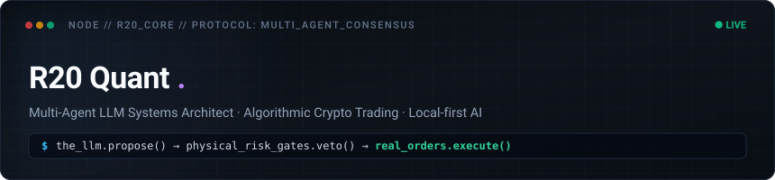

<div align="center">



<br/>
<br/>

[](https://www.r20.cn)
[](https://www.astraquant.tech)
[](https://linux.do/)
[](https://www.python.org/)
[](https://flutter.dev)
[](https://vuejs.org/)

</div>

---

### ⚡ $ whoami

> *"The LLM proposes. Python physically disposes. Nothing here is simulated by default."*

专注于 **Multi-Agent 协同架构** 与 **高可用实盘量化交易系统**。探索大模型在自主智能、博弈推演与金融实战中的工程边界：

- 🧠 **Multi-Agent 智能体博弈与共识**：设计多专业席位相互辩论、CIO 决策仲裁与自进化提示词工程。
- 🛡️ **Fail-Closed 物理硬风控**：坚守确定性代码对大模型幻觉的终极约束，建立 17+ 道熔断式硬风控防护门禁。
- 📱 **本地优先与边缘端 AI 交互**：构建基于 Flutter 的移动端沉浸式客户端，精细化管理世界书、分层记忆与 Prompt 组装。
- 🐧 **开源社区践行者**：[LINUX DO](https://linux.do/) 深度参与者与技术探索者。

---

### 🚀 核心工程项目 / Featured Systems

<table>
  <tr>
    <td width="50%" valign="top">
      <h4>📈 <a href="https://github.com/555cute/astra-quant-agent">AstraQuant</a></h4>
      <p><b>多交易所 AI 投委会量化实盘系统</b></p>
      <p>集成 OKX / Binance / Gate 三所平权交易，采用多 Agent 多空激辩、CIO 决策仲裁、17 道物理硬风控门禁，包含 10,000+ 自动化测试的高可靠系统。</p>
      <p><code>Python</code> · <code>FastAPI</code> · <code>Vue 3</code> · <code>Multi-Agent</code> · <code>Crypto Quant</code></p>
    </td>
    <td width="50%" valign="top">
      <h4>📱 <a href="https://github.com/555cute/role-tavern">Role Tavern (角色酒馆)</a></h4>
      <p><b>移动端沉浸式 Flutter AI 角色扮演客户端</b></p>
      <p>连接任意 OpenAI 兼容接口，本地优先管理角色卡（SillyTavern 兼容）、世界书递归触发、长期分级记忆与流式 Prompt 组装引擎。</p>
      <p><code>Flutter</code> · <code>Dart</code> · <code>Android</code> · <code>RAG</code> · <code>Local-First</code></p>
    </td>
  </tr>
  <tr>
    <td width="50%" valign="top">
      <h4>🎨 <a href="https://github.com/555cute/pi-wisart">WisArt (智画创) pi 扩展</a></h4>
      <p><b>AI 辅助编程的视觉驱动前端工作流</b></p>
      <p>为 pi 编码助手打造的图片生成扩展，实现“先生成高保真设计图，再提取色板与组件编写精准代码”的反模板化工作流。</p>
      <p><code>TypeScript</code> · <code>Node.js</code> · <code>Vision AI</code> · <code>Design System</code></p>
    </td>
    <td width="50%" valign="top">
      <h4>🌐 <a href="https://www.astraquant.tech">AstraQuant Official Site</a></h4>
      <p><b>量化终端与策略展示中心</b></p>
      <p>提供多所实时行情接入、多智能体实时决策流与风险监控看板，服务于高确定性量化交易需求。</p>
      <p><code>Live Trading</code> · <code>WebSockets</code> · <code>Risk Analytics</code></p>
    </td>
  </tr>
</table>

---

### 🛠️ 技术矩阵 / Engineering Matrix

```text
┌───────────────────────┬────────────────────────────────────────────────────────┐
│ 领域 (Domain)         │ 核心技术栈与架构规范 (Technologies & Architecture)     │
├───────────────────────┼────────────────────────────────────────────────────────┤
│ 🧠 Multi-Agent & LLM │ 投委会辩论拓扑、动态提示词插槽、分层语义记忆、RAG 向量检索    │
│ 📊 Quant & Execution  │ Python 3.10+、FastAPI、AsyncIO 高并发、三所交易网关、Fail-Closed│
│ 📱 Mobile & Frontend  │ Flutter (Android)、Vue 3.5+、TypeScript、Pinia、Tailwind CSS   │
│ 🔒 Quality & Ops      │ Pytest 架构门禁、Docker 容器化、10k+ 严格测试、自动化 CI/CD     │
└───────────────────────┴────────────────────────────────────────────────────────┘
```

---

### 📬 联系与站点 / Connect

- 🌐 **官方主页**：[www.r20.cn](https://www.r20.cn) · [www.astraquant.tech](https://www.astraquant.tech)
- 🐧 **技术社区**：[LINUX DO](https://linux.do/)
- 📧 **电子邮箱**：[quant@r20.cn](mailto:quant@r20.cn)

<br/>

<div align="center">
  <sub>Designed with precision · 2026 R20 Quant · Code over hype</sub>
</div>
